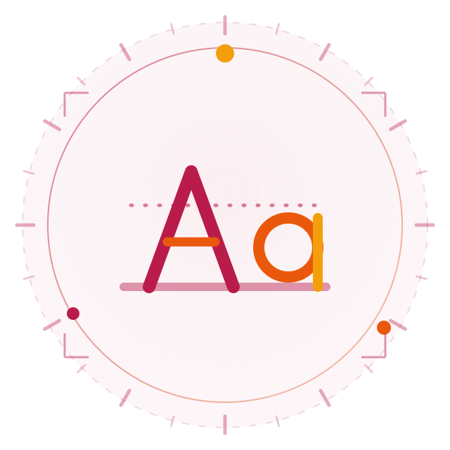

# EkGuru design system (v200 — the experience layer)

**Status:** live on `/`, `/support/`, `/courses/`, `/search/` and the six
translated home pages. Every other page inherits the same look through the
bundled stylesheet and needs no markup change.

## The one idea

EkGuru ships one page per market. Before v200 all of them looked the same:
the same violet, the same shapes, the same motion — and a visitor on `/ar/`
read right-to-left text next to a left-to-right drawing.

The experience layer makes the interface speak the visitor's language:

| Layer | What changes per language | Where it lives |
|---|---|---|
| Palette | primary / secondary / accent per language family | `css/experience.css` §2 |
| Motif | one repeating geometry per family, drawn in CSS | §2, applied in §4 |
| Script | type scale, line-height and font stack per writing system | §3 |
| Motion | entrance accent per writing system | §22 |
| Artwork | a drawn emblem per market (`images/xp/world-*.svg`) | §21 + `tools/build-world-art.py` |
| Copy | every string, in seven languages | `js/i18n.js` |

## Rules that must not be broken

1. **Nothing hides without JavaScript.** `html.xp-anim` is added by
   `js/experience.js` only when it can actually reveal. No JS, or a broken
   script, and the page is complete and readable.
2. **Every animation is cancelled** by `@media (prefers-reduced-motion: reduce)`.
3. **Interactive targets stay ≥ 44px** on `@media (pointer: coarse)`.
4. **Logical properties only** (`inline-start`, `margin-inline`, …) so RTL
   needs no separate stylesheet.
5. **Generator-written class names are contractual** — `.m-card`,
   `.course-card`, `.egc`, `.tcard`, `.mkt`, `.reveal`, `.stagger`. Restyle
   them, never rename them.
6. **No price is ever typed into a string.** Use the `{minPrice}` token or a
   `data-usd` element; `js/pricing.js` fills it from the live rate table.

## Components

All of them live in `css/experience.css` and are plain classes — no build step
for a new page:

* **Shell** — `.xp-main`, `.xp-wrap`, `.xp-band`, `.xp-orb`, `.xp-sec(.soft)`,
  `.xp-head`, `.xp-kicker`, `.xp-rule`
* **Hero** — `.xp-hero`, `.xp-hero-copy`, `.xp-visual`, `.xp-ring`,
  `.xp-medallion`, `.xp-letters`/`.xp-letter`, `.xp-float`, `.hero-card`
* **Search** — `.xp-searchbox`, `.xp-searchbar`, `.xp-search-hint`, `.xp-kbd`
* **Rail** — `.xp-rail`, `.xp-rail-track`, `.xp-rail-item`
* **Cards** — `.xp-grid(-2/-3/-4)`, `.xp-card`, `.xp-card-ico`, `.xp-card-link`,
  `.xp-steps`/`.xp-step`, `.xp-quote`, `.xp-stat`, `.xp-cta`, `.xp-tutor*`
* **Artwork** — `.xp-world`, `.xp-world-hero`, `.xp-world-herochip`,
  `.xp-world-bleed`, `.xp-world-inline`
* **Motion hooks** — `.xp-rise`, `.xp-stagger`, `.reveal` (all opt-in via JS),
  `.xp-sheen`

## The header on a phone

The six translated pages carry their own header and deliberately do not load
`js/main.js` (it expects to run from the site root). Until v200 that left them
with no burger: at 390px four links and a pill-button wrapped into two ragged
rows and the booking button was clipped off the right edge.

Each of those headers now carries a `.burger`, and `js/experience.js` §11 wires
the drawer — the same panel the English pages get from `main.js`, from the same
shell stylesheet. The two can never fight: if `main.js` has already bound the
header it gives the nav an `id`, and §11 then returns without touching it.

Below 1200px the nav is a drawer on every page. Between 1201 and 1300px it is
at its tightest, so §20b trims the link gap by 4px rather than let the first
link slide under the logo.

Gate: `node tools/check-header-pages.mjs --url http://127.0.0.1:8080`
(puppeteer-core; `--ld-library-path` if the browser lives outside the loader
path) — 8 pages × 12 widths, no overlap, no viewport overflow, drawer opens
and closes with the right ARIA state.

## The artwork

```html

```

* `data-xp-world="auto"` — follow the interface language (home pages).
* `data-xp-world="ja"` / `"hi"` / `"multi"` — this page belongs to one world
  and keeps it (support/ is about Hindi lessons whoever is reading;
  courses/ and search/ span every language).
* The static `src` is always correct on its own, so a crawler and a no-JS
  visitor see the right emblem.

Emblems are drawn by `tools/build-world-art.py` from the palettes in
`css/experience.css` — the stylesheet is the source of truth, so the drawing
can never drift from the colours the page uses.

## Pages, and what writes them

| Page | Source | Tool |
|---|---|---|
| `/` | hand-written | — |
| `/support/` | hand-written | — |
| `/search/` | hand-written (`js/site-search.js` is the engine) | — |
| `/courses/` | catalogue in `data/courses/index.json` | `tools/build-course-hub.py` |
| `/es/ /fr/ /de/ /pt/ /ja/ /ar/` | `js/i18n.js` + `js/tutors/*` | `tools/build-market-pages.js` |
| `/search/` country + language lists | `search-index.json` | `js/site-search.js` §facets |
| `tutor/<id>/` + `sitemap-tutors.xml`, `sitemap.xml`, `feed.xml` | `js/tutors/<id>.js` + `_registry.js` | `tools/build-tutor-pages.js` |
| the tutor grid on `/`, and the six market grids | `js/tutors/*` | `tools/build-home-tutors.js` |
| the `<script>` tags that load the tutors | `js/tutors/_registry.js` | `tools/langsync.js` |
| `hindi-tutor/*`, `tutor/`, `*/find-tutors.html` | `js/tutors/*` | `tools/build-roster-rows.js` |
| the header and footer on **every** page | the settings tab (tagline, email, mode) | `tools/build-shell.js` |
| the 969 pre-v200 pages: body design, the support band, each page's next step | `css/experience.css` §25 + the page itself | `tools/build-legacy-pages.py` |
| `/terms/ /privacy/ /disclaimer/ /copyright/` contents card + clause ids | the page's own headings | `tools/build-legal-pages.py` |

The market pages are generated because six hand-edited copies is exactly how
they drifted apart before. The generator rewrites **only `<main>`** — head,
header, footers and script tags are preserved byte for byte, so SEO work on
those pages can never be lost by a rebuild.

## One header, one footer, on every page

Every page — hand-written, generated, quiz, worksheet, country funnel, 404 —
carries the same `header.hdr` and `footer.ftr`, wrapped in
`ekguru:shell-header` / `ekguru:shell-footer` markers and written by
`tools/build-shell.js`. Before it existed there were three different taglines
in three different places and ~1,500 pages with no header at all.

- **The values come from the settings tab**, not from the markup: the tagline,
  the contact address and the "mode" line are read through
  `tools/lib/site-data.js` (which reads what `tools/sheetsync.js` wrote).
  Change the tagline in the spreadsheet, re-run the build, and every page and
  every printed footer follows — `js/site-shell.js` re-applies the same value
  at runtime when a live copy is on the page.
- **The market pages are translated, not English with a different `lang`.**
  The six locales take their labels from `js/i18n.js` — the same dictionary
  they already load — and keep their own three pages (home, find-tutors,
  join) as the targets of the nav.
- **One owner of the drawer.** The shell page carries `js/site-shell.js`, the
  hand-written pages carry `js/main.js`, and both want the same burger.
  `window.EKGURU_DRAWER` is the handshake: first one to bind claims it, the
  other stands down. Two handlers on one button is not cosmetic — one click
  opens the drawer and closes it again, which is the "3 lines open karte hi
  bug" report. `tools/test-shell-drawer.mjs` drives the real file in a DOM and
  fails if a click stops opening the menu.
- **The scroll lock is the v74 rule** in both files: remember `scrollY`, pin
  the body with `top:-<offset>px`, restore with `behavior:"auto"`. Anything
  else reads as the jump the lock exists to remove.
- `--check` fails if any page is out of date, and the write is idempotent by
  comparison (not by a "touched" flag), so a second run changes nothing.

## Country and language in search

`/search/` answers three questions that used to be one: what kind of page
(section pills, generated by `tools/build-search-index.py`), **which country**
(196 country funnels plus the city tutor pages) and **which language** (the
"for speakers" guides, the starter packs and the translated Hindi guides).
Both dropdowns are built at load from `search-index.json`, so a new funnel or
pack appears in them with no edit, and the three filters combine.

The language list exists because the site spells a language three ways — the
guide says `japanese`, the starter pack says `ja`, the market says `ja/hindi`.
They are merged into one English name learned from the index itself, so
"Japanese" appears once with all seven of its pages rather than twice with
half. `tools/test-search-facets.mjs` holds that line.

## The document pages (legal, and the long tail)

Terms, privacy, disclaimer and copyright arrive with one question and no
patience for a wall of prose, so `tools/build-legal-pages.py` gives every
clause an `id`, builds the **On this page** contents card from those headings
and marks the block `.xp-doc`. It never touches a word: the tool compares the
prose before and after and refuses to write if they differ, because legal
wording is the last thing a build script should rewrite to suit a stylesheet.

## The reading layer (the 969 hand-written pages)

Every page written before the v200 system — 195 country funnels, the language
topic pages, `daily-hindi/*`, the toolbox, the tutor lists, the answers — used
to carry its own copy of the same body CSS: 13 template variants, ~3 KB each,
239 distinct selectors, each copy a little further from the others. That is the
duplication this project has already paid for five times (the v79 note in the
tool pages counts them).

`css/experience.css` §25 is that CSS now, once, in the v200 language. The
pages carry `class="pw pw-legacy"` and nothing else: one accent per page
(`--sb-accent` when the page has a language theme, the v200 accent when it does
not), one radius family, one elevation family, one motion vocabulary, and the
same components they always had — `.lede`, `.facts`, `.faq`, `.chips`, `.card`,
`table.lang`, `table.phr`, `.note`, `.cta`, `.prevnext`, `.linklist`, `.howto`,
`.tut`, the tool controls, the contact form.

`tools/build-legacy-pages.py` is what puts them there, and it refuses to guess:

* a rule is dropped only when §25 provably owns it — a real selector lookup
  against `css/experience.css`, per rule, including inside `@media` blocks.
  Anything unowned stays put. Today exactly one rule survives site-wide
  (`#dlist li` on `daily-hindi/`), and `--report` prints the list.
* every `<td>` in a table with a header row gets `data-h="<its <th>>"`, so the
  phone layout restacks the row as labelled pairs. The old mobile rule *hid*
  column four of `table.lang`; that rule is now dropped on purpose.
* the five pages that are already v200 (`/terms/ /privacy/ /disclaimer/
  /copyright/ /support/`) are left alone — they have the class `pw` but not
  `pw-legacy`, so no rule in the layer can reach them, and `.card` keeps two
  meanings safely (a link card in `.cards`, a flashcard inside a tool).

Two bands are added to every one of the 969 pages, both as chrome
(`<footer>`/`<nav>`) so the copy index reads them as chrome and not as prose:

* `.pw-support` — the promise the site makes everywhere else and, until now,
  said on none of these pages: every lesson is free and always will be, with
  the two ways to keep it free.
* `.pw-next` — the next step, derived from the page: a country page names the
  languages EkGuru can actually teach for that country (from the same relation
  `/courses/by-country/` is built from) and links to `/courses/?country=XX`;
  a language page links to its own course.

Prose is untouched: a jsdom pass over all 969 pages compares the text before
and after the rewrite, and 969/969 come out byte-identical.

## The page layer (the other 555 hand-written pages)

The reading layer covered the pages whose container is `.pw`. These are the
rest of the hand-written site, and they were still carrying the same story:
the language lessons, the answers, the ask pages, the directories and hubs —
555 pages, each with its own `<style>` block holding a copy of the same rules,
1.4 MB of it in total.

They did not need a second stylesheet. Their container (`.art`, `.qw`, `.aw`)
is marked with the class §25 already owns — `<div class="art pw-legacy">` —
so every reading-layer rule reaches them at once, and `css/experience.css` §26
adds only what these pages have and §25 did not: the topic cards (`.hs-card`),
the language directory (`.lang-grid`, `.lang-cell`, `.lang-finder`, `.chip`),
the vocabulary and grammar blocks the language courses are built from
(`.v-*`, `.g-*`), the practice widgets (`.sc-*`, `.ob-*`, `.hi-listen`), the
callouts (`.pg-note`, `.pg-cta`), the related-link lists, and the country
index cards.

`tools/build-page-layer.py` does the work, with the reading layer's own
selector lookup (it imports it) so the two layers cannot drift apart, and one
extra rule that matters: a page's `.art h1` and the layer's `.pw-legacy h1`
style the same element once the container is marked, so the page's copy is
dropped — otherwise it would sit after the bundle and quietly win, which is
the stale style this project has shipped five times.

Same guarantees as the reading layer: the duplicated CSS is gone (12.5 KB left
site-wide, in 15 pages whose component exists on no other page — `.cc-*`, one
SRS prompt each), tables are named and restack instead of hiding a column,
`data-h` everywhere a column name is known, and every page gains the same two
bands. Prose is untouched: `data/copy-index.json` — 1,459 page fingerprints
over the prose alone — comes out byte-identical after the migration.

## Build / check loop

```bash
python3 tools/build-all.py check            # every generator's --check + the DOM test
```

That one command is the gate. It runs, in order:

```bash
python3 tools/bundle-experience-css.py --check   # css/experience.css → css/style.min.css
python3 tools/build-world-art.py   --check       # the nine market emblems
python3 tools/build-course-hub.py  --check       # /courses/ + the home teaser
python3 tools/build-course-countries.py --check   # /courses/by-country/ + its sitemaps
python3 tools/build-legacy-pages.py --check       # the 969 pages on the reading layer
python3 tools/build-page-layer.py  --check       # the 555 pages on the page layer
node    tools/langsync.js          --check       # tutor <script> tags, all 23 pages
node    tools/build-tutor-pages.js --check       # profiles + sitemaps + feed
node    tools/build-home-tutors.js --check       # the home page's tutor grid
node    tools/build-market-pages.js --check      # the six market home pages
node    tools/build-roster-rows.js --check       # 44 more pages that list tutors
node    tools/test-page-layer.mjs                # the page layer's own guardrails
node    tools/test-experience-dom.mjs            # DOM smoke test (needs: npm i jsdom)
node    tools/test-search-facets.mjs             # country + language dropdowns
node    tools/test-shell-drawer.mjs              # one owner of the menu button
node    tools/test-copy-index.mjs                # the ownership matcher
node    tools/test-course-country.mjs            # course search by country, both ways
node    tools/test-reading-layer.mjs             # one stylesheet, two bands, 969 pages
node    tools/build-shell.js            --check  # header + footer on 1,563 pages
node    tools/build-copy-index.js       --check  # ownership fingerprints
python3 tools/build-legal-pages.py      --check  # the five legal pages' contents cards
python3 tools/inject-ads.py             --check  # the ad policy: loader only where the matrix says
node    tools/test-ad-policy.mjs                 # no ad tag on a page the policy excludes
node    tools/test-print-sheet-dom.mjs           # printing prints the sheet, not the page
```

### The ad policy is data, not a directory list

`data/monetization/google-monetization.json` → `ad_policy` names seven page
classes and the path patterns that belong to each. `tools/inject-ads.py` puts
one marked loader block in `<head>` only where `loader_allowed` says so, strips
every ad tag, marker and unit everywhere else, and writes the class the page got
onto `<html data-ad-class="…">`. `--check` fails if a page disagrees with the
matrix, and `tools/test-ad-policy.mjs` proves the negative: **no page the policy
excludes carries the ad loader**, which is the only promise that survives Auto
ads placing units by itself. A hard-coded directory list and the matrix had
drifted apart — which is how the legal pages ended up loading an advertising
script they were excluded from.

Without `check` the same chain writes instead of comparing — `python3
tools/build-all.py` runs it as the last phase of the full rebuild (phase 12),
after the injectors, so nothing can overwrite a generated block. `node
tools/gate.js` runs the five tutor generators a second time as the
`tutor-roster` check, so a deploy where one page still lists four tutors fails.

`css/style.min.css` carries the whole layer, so the ~1,500 pages that only link
the stylesheet — country funnels, lessons, tools, guides — re-tint and
re-motif with no HTML edit at all. **Always re-run the bundler after editing
`css/experience.css`**; `--check` exits 1 when the bundle is stale.

## The cookie policy is a page, not a banner

`cookie-policy/index.html` is the fifth legal page (`tools/build-legal-pages.py`
gives it ids and a contents card like the other four) and every footer links to
it. It answers what the site actually does: **no cookie is set by EkGuru at
all**; preferences and progress live in named `localStorage` keys listed in the
page; analytics is cookieless and ships nothing while no provider is configured;
the only third-party cookies are Google's advertising and consent products,
covered by a Google-certified CMP — `js/cookie-consent.js` stays a no-UI
boundary and a home-made banner is never the answer.

## Adding a language

1. Add the locale to `EKGURU_MARKETS` in `js/site-config.js`.
2. Copy a block in `js/i18n.js` and translate the values.
3. Add a palette block in `css/experience.css` §2 (`--xp-a/b/c`, `--xp-motif`,
   `--world-*`) and, if the writing system is not Latin, its rhythm in §3.
4. `python3 tools/build-world-art.py` (add the code to `LANG_SELECTOR`).
5. `python3 tools/bundle-experience-css.py`.

`js/experience.js` picks the rest up from `html[lang]` — palette, motif,
script rhythm, motion accent and page copy.
